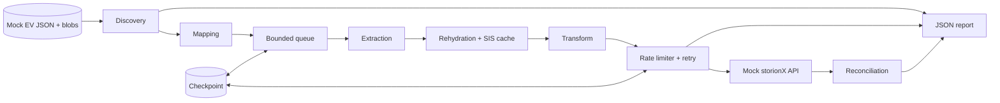

# Enterprise Vault → storionX Migration Design

## Yaklaşım

Migration aracı EV arşivlerini keşfeder, kullanıcı ve hedef arşiv eşlemesini yapar, SIS parçalarını birleştirir ve içeriği oluşturacağımız mock storionX API'ye gönderir.

Temel kurallar:

- EV kaynağı salt okunur kullanılır.
- Retention, legal hold ve özgün metadata korunur.
- Aynı migration tekrar çalıştırıldığında duplicate oluşmaz.
- Tek bir hatalı öğe tüm çalışmayı durdurmaz.
- Kaynak verisi ancak migration doğrulandıktan sonra ayrı bir süreçle temizlenebilir.

## Migration senaryoları

| Senaryo | storionX'teki karşılığı | Amaç |
| --- | --- | --- |
| Mailbox arşivi | Kullanıcı arşivi | Aktif kullanıcının eski e-postalarını, klasörlerini ve eklerini korumak. |
| Journal arşivi | Kısıtlı compliance store | Kurum trafiğini denetim, eDiscovery ve yasal gereksinimler için saklamak. |
| FSA | Dosya/content arşivi | Arşivlenmiş dosyaları yol, tarih ve retention bilgileriyle taşımak. |
| Sahipsiz arşiv | Bekletme kuyruğu veya orphan arşivi | Veriyi yanlış kullanıcıya bağlamadan operatör kararını beklemek. |
| Ayrılan kullanıcı / legal export | Pasif kullanıcı arşivi veya dava export'u | Offboarding ve yasal inceleme ihtiyaçlarını karşılamak. |
| SharePoint arşivi | Site/library bazlı content arşivi | Belge yolu, sürümü, yazarı ve tarihlerini korumak. |
| SMTP / uygulama arşivi | Kaynak uygulama bazlı arşiv | Exchange dışındaki mesaj ve uygulama verilerini taşımak. |

## Detaylı akışlar

### 1. Mailbox arşivi

1. **Keşif:** Arşivler, öğeler, owner UPN, retention ve legal hold bilgileri okunur.
2. **Eşleme:** `owner_upn`, storionX kullanıcı arşiviyle eşlenir. Eşleşmeyen arşiv bekletilir ve raporlanır.
3. **Çıkarma:** Öğenin metadata'sı ve referans verdiği SIS parçaları okunur.
4. **Rehydration:** Parçalar doğru sırayla birleştirilir; boyut ve SHA-256 değerleri doğrulanır. Ortak parçalar cache'ten okunur.
5. **Dönüştürme:** Subject, from/to, sent date, klasör yolu, retention ve legal hold hedef modele çevrilir.
6. **Yükleme:** İçerik idempotency key ile mock API'ye gönderilir. `429/503` yanıtlarında retry uygulanır.
7. **Doğrulama:** Kaynak ve hedef item sayısı, byte toplamı ve hash değerleri karşılaştırılır.
8. **Temizlik ve rapor:** Shortcut'lara otomatik dokunulmaz. Sonuçlar JSON rapora yazılır.

### 2. Journal arşivi

1. **Keşif:** Journal arşivleri mailbox arşivlerinden ayrı bulunur.
2. **Eşleme:** Kullanıcı arşivine değil, erişimi kısıtlı compliance store'a eşlenir.
3. **Çıkarma:** Özgün mesaj, sender, TO/CC/BCC ve envelope bilgileri alınır.
4. **Rehydration:** Mesaj gövdesi ve ekler SIS parçalarından oluşturulup hash kontrolünden geçirilir.
5. **Dönüştürme:** Recipient, capture time, retention ve hold bilgileri compliance kaydına çevrilir.
6. **Yükleme:** Rate limit ve idempotency kurallarıyla API'ye gönderilir.
7. **Doğrulama:** Gün/arşiv bazında item, byte ve hash karşılaştırması yapılır.
8. **Temizlik ve rapor:** Legal hold verisi temizlenmez; sonuç ve chain-of-custody bilgileri raporlanır.

### 3. FSA

1. **Keşif:** File server, volume, archive point, dosya yolu ve placeholder bilgileri bulunur.
2. **Eşleme:** Kaynak archive point, storionX content arşiviyle eşlenir.
3. **Çıkarma:** Dosya içeriği EV arşivinden okunur; placeholder açılarak kontrolsüz recall yapılmaz.
4. **Rehydration:** SIS parçaları birleştirilir; dosya boyutu ve hash doğrulanır.
5. **Dönüştürme:** UNC path, dosya adı, zamanlar, ACL özeti ve retention hedef modele çevrilir.
6. **Yükleme:** Büyük dosyalar byte limitini dikkate alan worker'larla gönderilir.
7. **Doğrulama:** Dosya sayısı, toplam byte ve içerik hash'leri karşılaştırılır.
8. **Temizlik ve rapor:** Placeholder silme otomatik yapılmaz; başarısız ve eksik dosyalar ayrıca raporlanır.

## Mimari

| Bileşen | Görevi |
| --- | --- |
| Discovery | Arşivleri ve öğeleri tarar. |
| Mapping | Kullanıcı, orphan, retention ve legal hold politikalarını uygular. |
| Extraction | Metadata ve SIS parçalarını kaynaktan okur. |
| Rehydration | Parçaları birleştirir ve hash doğrular. |
| Transform | EV öğesini storionX modeline çevirir. |
| Ingestion | Rate limit, retry ve idempotency ile yükleme yapar. |
| Checkpoint | Tamamlanan öğeleri saklar ve resume sağlar. |
| Reporting | Sayım, byte, hata ve doğrulama sonuçlarını üretir. |

## Mock storionX API

`POST /ingest` şu bilgileri kabul eder:

- Hedef arşiv kimliği
- Kaynak archive/item kimliği
- Sıralı içerik parçaları ve SHA-256 değerleri
- E-posta veya dosya metadata'sı
- Retention category ve legal hold bilgisi
- `Idempotency-Key: ev:{archive_id}:{item_id}` başlığı

API davranışı:

- Saniyelik istek ve dakika başına MB limiti uygular; aşılırsa `429` döner.
- Yapılandırılabilir şekilde yaklaşık `%5` geçici `503` hatası üretir.
- Aynı idempotency key'i ikinci kez kaydetmez.
- Aynı SHA-256 değerine sahip SIS parçasını yalnızca bir kez saklar.
- Doğrulama için yüklenen item'ları ve hedef arşivleri listeler.

## Temel zorluklar

### SIS ve rehydration

Aynı SIS parçası birçok öğede kullanılabilir. Parçalar hash ve boyut kontrolüyle birleştirilir. Tekrar okumayı azaltmak için boyutu sınırlı bir cache kullanılır. Hedef de parça hash'lerine göre yeniden dedup yapar.

### Rate limit ve retry

Bütün worker'lar ortak bir rate limiter kullanır. `429` yanıtında `Retry-After` dikkate alınır. `429`, `503` ve timeout için exponential backoff + jitter uygulanır. Validation ve hash hataları tekrar denenmez.

### Ölçek ve resume

Veri belleğe topluca alınmaz; item'lar bounded queue üzerinden işlenir. Her başarılı öğe checkpoint'e yazılır. İş yarıda kesilirse tamamlanan öğeler atlanır ve kalanlar devam eder.

### Metadata ve chain of custody

Özgün tarih, klasör/dosya yolu, sender/recipient, retention ve legal hold korunur. Her item için kaynak kimliği, kaynak hash'i, hedef kimliği, deneme sayısı ve UTC işlem zamanı audit raporuna yazılır. İçerik ve kişisel bilgiler loglanmaz.

### Mapping ve legal hold

UPN eşleşmeyen veya birden fazla hedefe uyan arşiv otomatik atanmaz. Bekletme kuyruğuna alınır. Legal hold altındaki veri taşınır ve hedefte işaretlenir fakat kaynak temizliğine dahil edilmez.

### Idempotency ve doğrulama

Kaynak archive/item kimliği değişmez idempotency key olarak kullanılır. API isteği kabul edip cevap kaybolsa bile tekrar gönderim duplicate oluşturmaz.

Çalışma sonunda şu değerler karşılaştırılır:

- Taranan, filtrelenen, bekletilen, yüklenen ve başarısız item sayıları
- Kaynak ve hedef toplam byte değerleri
- İçerik hash'leri
- Hata türleri ve retry sayıları

Item sayıları uyuşsa bile byte veya hash farkı varsa migration başarılı kabul edilmez.

## Kaynak temizleme

Migration motoru EV verisini veya shortcut/placeholder'ları silmez. Yalnızca doğrulanmış aday listesi üretir. Temizlik; reconciliation tamamlandıktan, ilgili ekipler onay verdikten ve legal hold kontrol edildikten sonra ayrı bir işlem olarak yapılır.

