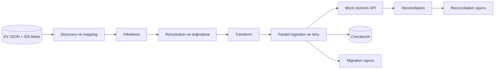

# Enterprise Vault → storionX Migration Design

## Amaç ve kapsam

Bu demo, JSON katalog ve SIS blob dosyalarıyla temsil edilen Enterprise Vault verisini mock storionX API'ye taşır.

Desteklenen archive türleri:

| Kaynak | Hedef | Eşleme |
| --- | --- | --- |
| Mailbox | Kullanıcı arşivi | Owner UPN üzerinden |
| Journal | Compliance arşivi | Tek bir compliance hedefi üzerinden |
| FSA | Dosya arşivi | Kaynak archive ID üzerinden |
| Sahipsiz veya eşleşmeyen archive | Bekletilir | Otomatik migration yapılmaz |

Kaynak snapshot salt okunur kullanılır. Uygulama EV verisini, shortcut'ları veya placeholder'ları silmez.

## Veri modeli

Kaynak katalog üç temel veri içerir:

- Archive: tür, owner ve legal hold bilgisi
- Item: mesaj veya dosya metadata'sı, retention ve sıralı SIS part referansları
- SIS part: blob yolu, boyut ve SHA-256 değeri

Mailbox ve journal item'larında sender, recipient, subject, tarih ve klasör yolu tutulur. FSA item'larında ayrıca dosya yolu ve değiştirilme tarihi bulunur.

Hedef archive eşlemeleri `backend/samples/target-archives.json` dosyasında tutulur:

- `user_archives`: UPN → kullanıcı arşivi
- `compliance_archive_id`: journal hedefi
- `file_archives`: kaynak FSA archive ID → dosya arşivi

## Migration akışı

1. JSON katalog belleğe yüklenir.
2. Mailbox, journal ve FSA archive'ları hedeflerle eşlenir.
3. Tarih, archive ve klasör filtreleri uygulanır.
4. Mapping bulunan item'ların SIS parçaları sırasıyla okunur.
5. Her parçanın boyutu ve SHA-256 değeri doğrulanır. Aynı çalışma içinde ortak parçalar cache'ten kullanılır.
6. Metadata, retention ve legal hold hedef modeline dönüştürülür.
7. Item'lar ayarlanabilir worker sayısıyla paralel olarak API'ye gönderilir.
8. Başarılı item'lar checkpoint'e, çalışma özeti ve hatalar JSON rapora yazılır.
9. Reconciliation kaynak ve hedef item ID, hedef archive, byte ve içerik hash değerlerini karşılaştırır.

Tek bir item'ın rehydration veya ingestion hatası diğer item'ların işlenmesini durdurmaz.

## FSA akışı

FSA ayrı bir migration motoru kullanmaz. Mailbox ve journal ile aynı akışı paylaşır.

1. FSA archive, kaynak archive ID ile `file_archives` mapping'inde aranır.
2. Mapping yoksa archive bekletilir ve içindeki item'lar gönderilmez.
3. Dosyanın SIS parçaları birleştirilir ve doğrulanır.
4. Dosya yolu, değiştirilme tarihi, retention ve legal hold bilgisi hedef metadata'sına eklenir.
5. İçerik aynı idempotency, retry, checkpoint ve reconciliation kurallarıyla taşınır.

Placeholder recall veya kaynak dosya temizliği yapılmaz.

## Mock storionX API

`POST /ingest` şunları kabul eder:

- Hedef archive ID
- `ev:{archive_id}:{item_id}` biçiminde kaynak item ID
- Sıralı içerik parçaları, boyutları ve SHA-256 değerleri
- Mesaj veya dosya metadata'sı
- Retention category ve legal hold
- Aynı kaynak item ID'yi taşıyan `Idempotency-Key` başlığı

API davranışı:

- Saniyelik istek ve dakika başına byte limiti uygular; limit aşımında `429` döner.
- Yapılandırılabilir şekilde geçici `503` üretir.
- Aynı idempotency key ve aynı içerik tekrar gönderildiğinde duplicate oluşturmaz.
- Aynı SHA-256 değerindeki SIS parçasını yalnızca bir kez saklar.
- `GET /state` ile item, byte ve hash bilgilerini reconciliation için döndürür.

## Retry ve devam etme

İstemci `429`, `503` ve bağlantı timeout'larında exponential backoff ve jitter ile tekrar dener. `429` yanıtındaki `Retry-After` değeri dikkate alınır. Kalıcı istemci hataları tekrar denenmez.

Her başarılı item atomik JSON checkpoint'e yazılır. Aynı komut yeniden çalıştırıldığında checkpoint'teki item'lar atlanır. Checkpoint kullanılmasa bile API idempotency kontrolü duplicate oluşmasını engeller.

## Raporlama ve doğrulama

Migration raporu şu bilgileri içerir:

- Taranan, filtrelenen, bekletilen ve denenen item sayıları
- Yeni yüklenen, hedefte zaten bulunan ve başarısız item sayıları
- Planlanan ve taşınan byte değerleri
- Retry ve SIS okuma sayıları
- Hata kategorileri ve başarısız item detayları

Reconciliation raporu şunları karşılaştırır:

- Kaynak ve hedef item sayısı
- Kaynak item ID ve hedef archive ID
- Mantıksal byte değerleri
- Rehydrate edilmiş içerik SHA-256 değeri

Eksik, beklenmeyen veya farklı bir item varsa reconciliation başarısız kabul edilir.

## Sınırlar

- Gerçek Enterprise Vault bağlantısı yerine JSON katalog ve blob dosyaları kullanılır.
- Demo verisi küçük olduğu için katalog ve seçilen item listeleri bellekte tutulur.
- SIS cache çalışma süresince bellekte tutulur ve boyut limiti yoktur.
- İçerik parçaları mock API'ye base64 olarak gönderilir.
- Mock API state'i bellektedir ve uygulama kapanınca silinir.
- Kaynak temizliği ve placeholder yönetimi bu uygulamanın kapsamı dışındadır.
